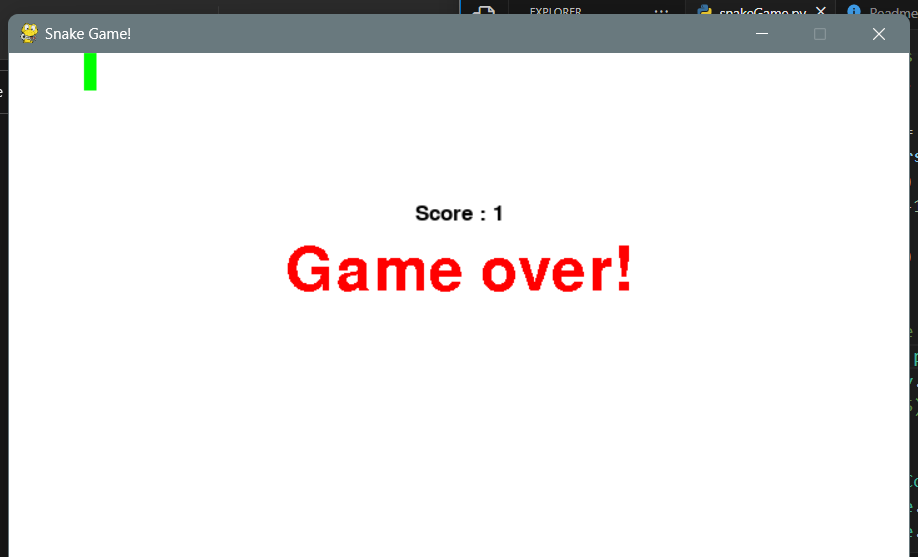

# Snake Game

Un clásico Snake Game implementado en Python usando la biblioteca Pygame.



## Tabla de contenido

- [Descripción](#description)
- [Características](#características)
- [Instalación](#instalación)
- [Cómo jugar](#cómo-jugar)
- [Controles](#controles)
- [Contribución](#contribución)

## Descripción

Esta es una implementación simple del clásico Snake Game usando Python y Pygame. El juego comienza con una sola serpiente que controlas usando las teclas de flecha o WASD. Tu objetivo es comer los cuadrados marrones (comida) para crecer más mientras evitas colisionar con los límites del juego y el propio cuerpo de la serpiente. El juego termina si te chocas contra una pared o chocas contigo mismo.

## Características

- Experiencia clásica del Snake Game.
- Controles simples e intuitivos.
- Seguimiento de la puntuación para ver qué tan bien te ha ido.
- Pantalla de fin del juego con tu puntuación final.

## Instalación

1. Clona el repositorio:

```
git clone https://github.com/Alvaro-Alonso-Portillo/snake-game.git
```

2. Navega hasta el directorio del proyecto:

```
cd snake-game
```

3. Instala las dependencias necesarias:

```
pip install pygame
```

4. Ejecuta el juego:

```
python snakeGame.py
```

## Cómo jugar

- Usa las teclas de flecha (Arriba, Abajo, Izquierda, Derecha) o las teclas WASD (W, A, S, D) para controlar la dirección de la serpiente.
- Come los cuadrados marrones (comida) para crecer más.
- Evita chocar con los límites del juego o con el propio cuerpo de la serpiente.
- Intenta lograr la puntuación más alta posible antes de que termine el juego.

## Controles

- Teclas de flecha (arriba, abajo, izquierda, derecha) o
- Teclas WASD (W, A, S, D)

## Contribuciones

¡Las contribuciones son bienvenidas! Si encuentra algún problema o tiene sugerencias para mejorar, abra un problema o cree una solicitud de incorporación de cambios.